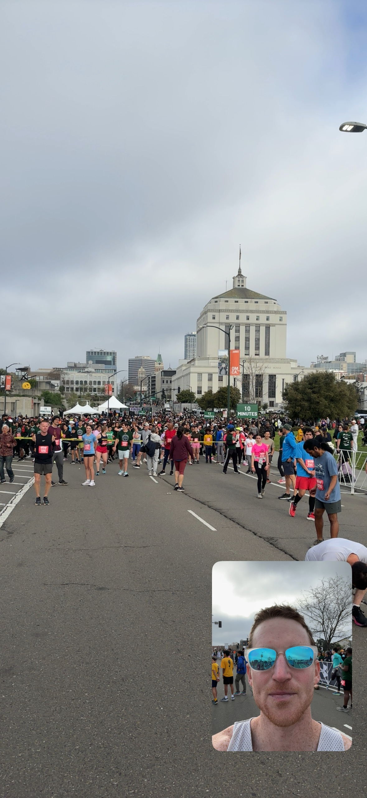
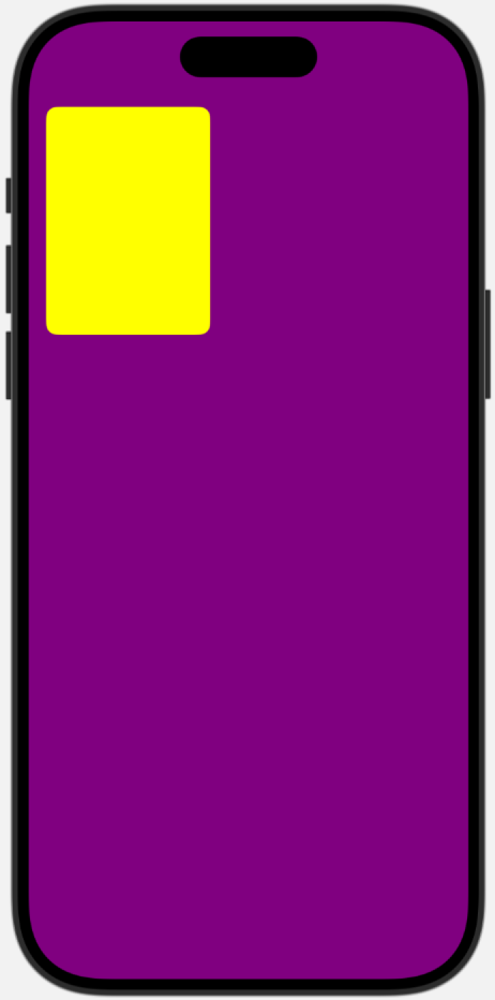
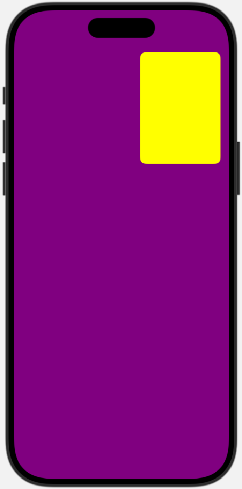
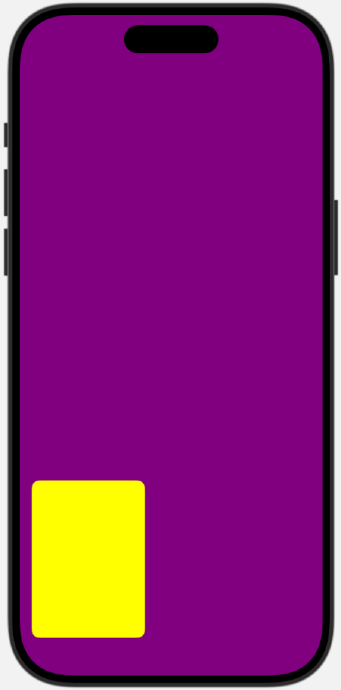
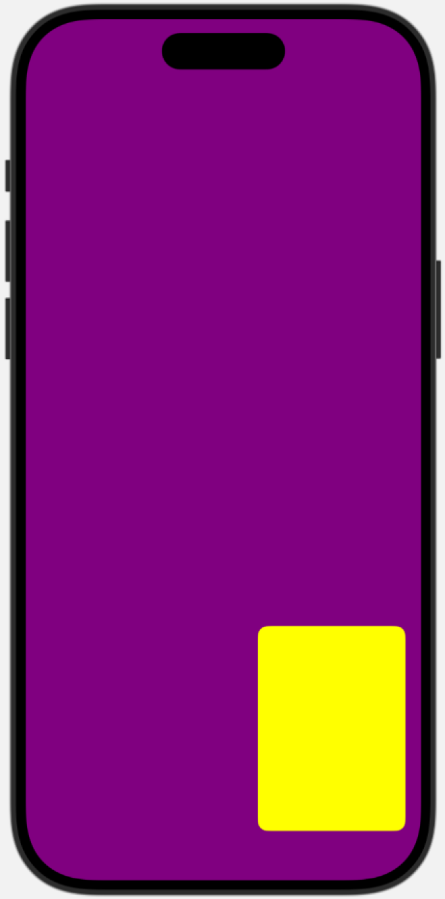
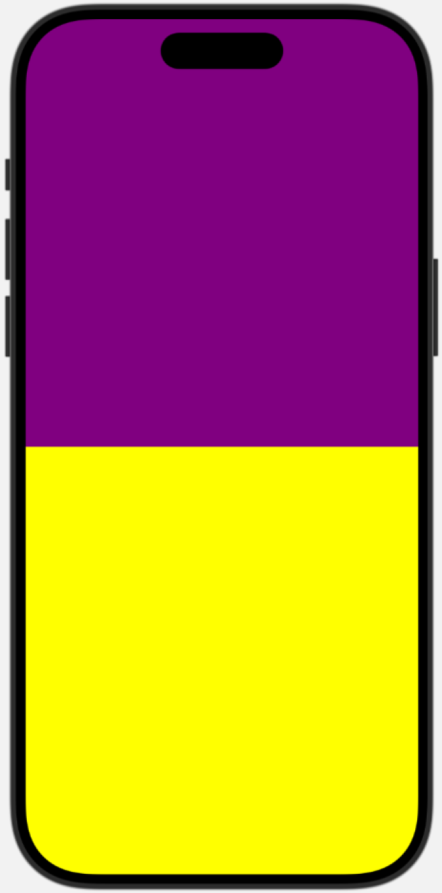
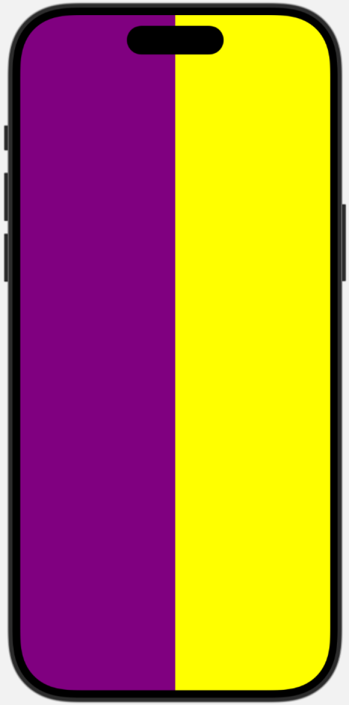

<div style="text-align: center;">
<b style="font-size: 30px"> DualCameraKit</b>

Simultaneous front & back iOS camera capture made simple.

</Div>

<div style="display: flex; justify-content: center; gap: 20px; margin: 20px 0;">
  <div style="text-align: center;">
    
    <p style="font-weight: bold;">Photo Capture</p>
  </div>
  <div style="text-align: center;">
    
    <p style="font-weight: bold;">Video Capture</p>
  </div>
</div>

# Status Overview

**Current Status**: Alpha release working towards 1.0

Pre-release available: [v0.3.0-alpha](https://github.com/Liampronan/DualCameraKit/releases/tag/v0.3.0-alpha).

| Category                | Status | Description                                                                                                                                      |
| ----------------------- | :----: | ------------------------------------------------------------------------------------------------------------------------------------------------ |
| 📱 **UI Components**    |   ✅   | Rendering dual cameras in SwiftUI with various layout options:<br>• Picture-in-picture<br>• Split vertical<br>• Split horizontal                 |
| 📸 **Photo Capture**    |   ✅   | Implemented via screen capture                                                                                                                   |
| 🎬 **Video Capture**    | v1 ✅  | **ReplayKit Mode**: High-def output (requires permission each time)<br>**CPU-based Mode**: Medium-def output (one-time permission only)          |
| 🧩 **Architecture**     |   🚧   | In progress: De-coupling components to offer 3 layers of customizability:<br>• Drop-in screen<br>• Compositional views<br>• Low-level components |
| 🔥 **GPU Acceleration** |   🚧   | Up Next: Adding GPU video capture for high-def recording without<br>recurrent permission requests                                                |
| 🎤 **Audio**            |   🚧   | Future: Adding audio capture support for video recording.                                                                                        |

# Table of Contents

- [What It Does](#what-it-does)
- [Requirements](#osrequirements)
- [Installing DualCameraKit](#installing-dualcamerakit)
  - [In Xcode](#in-xcode)
  - [In Package.swift](#in-packageswift)
- [Running the DemoApp - Local Code Signing Setup](#running-the-demoapp---local-code-signing-setup)
- [Basic Usage](#basic-usage)
- [Customization](#customization)
- [Troubleshooting](#troubleshooting)
- [Deep Dives](#deep-dives)
- [Limitations](#limitations)
- [References](#references)
- [License](#license)

# What It Does

`DualCameraKit` is an iOS library that makes simultaneous front & back camera capture simple – combining the view and the viewer in a single shot, as seen in apps like Snapchat and BeReal.

For simple, drop-in functionality, you can use `DualCameraScreen`, a SwiftUI View with buttons for photo capture, video recording, and toggling through the different dual-camera layouts and recording modes.

For deeper customizability, you can access the lower-level components that `DualCameraScreen` is built on

# Example Screenshot


The above screenshot is rendered from the code below. It's the simple, drop-in style and is using one of the pre-configured layouts, `.fullScreenWithMini`.

```swift
struct ContentView: View {

    var body: some View {
        DualCameraScreen(
            layout: .fullScreenWithMini(miniCamera: .front, miniCameraPosition: .bottomTrailing)
        )
    }

}
```

# Installing DualCameraKit

Since `DualCameraKit` is published using Swift Package Manager, you can install it by following these steps:

## In Xcode:

1. Go to **File > Add Packages...**
2. In the search bar, paste this [repository URL](https://github.com/Liampronan/DualCameraKit).
3. Select the version rule (e.g., "Up to Next Major" is recommended for most cases)
4. Click **Add Package**
5. Select the `DualCameraKit` library product
6. Click **Add Package** to complete the installation

## In Package.swift:

If you're developing a Swift package that depends on `DualCameraKit`, add it to your package dependencies:

```swift
dependencies: [
    .package(url: "https://url-to-dualcamerakit-repo.git", from: $VERSION_STRING_HERE$)
],
targets: [
    .target(
        name: "YourTarget",
        dependencies: ["DualCameraKit"]
    )
]
```

## OS/Requirements:

- Add camera permissions to your app's `Info.plist` - `Privacy - Camera Usage Description`
  

- Live, nonsimulator device, iOS 17+ for camera usage (simulator uses mocked camera).

After installation, you can import the library in your Swift files:

```swift
import DualCameraKit
```

# Running the DemoApp - Local Code Signing Setup

To get the demo app running, you'll need to:

1. set code signing to automatic,
2. select your development team - this dropdown appears after setting code signing to automatic

Since this library currently requires a real device, you cannot run it on a simulator.


# Overview - the three ways to use this library

Three are three different sets of components this library exposes, ranging from higher-level (drop-in, less customizable) to lower-level (more customizable). Each built on top of their lower level.

1. ✅ `DualCameraScreen`

- drop-in, least customizable.
- a full-screen SwiftUI view which with buttons for photo capture, video recording, and toggling through the different dual-camera layouts and recording modes.

2. 🚧 `DualCameraDisplayView` and `DualCameraController`

- medium customization - useful for using pre-configured dual camera layouts while customizing the control UI and post-capture behavior.
- the `DualCameraDisplayView` renders streams managed by the `DualCameraController`
- you're responsible for wiring up UI for photo capture, video recording managment, and layout config.

3. 🚧 Raw Components

- full customization - useful for unchartered territory e.g., you need to manipulate camera streams before they are rendered.

# Basic Usage

## `DualCameraScreen` - drop-in, full-screen component

```swift
struct ContentView: View {

    var body: some View {
        DualCameraScreen(
            layout: .fullScreenWithMini(
                miniCamera: .front,
                miniCameraPosition: .bottomTrailing
            )
        )
    }

}
```

# Camera Layout Types

```swift
public enum DualCameraLayout {
    case sideBySide
    case stackedVertical
    case piP(miniCamera: DualCameraSource, miniCameraPosition: MiniCameraPosition)
}
```

> Note: these screenshots are using colors to mock the front (purple) and back (yellow) cameras – this is how we're mocking things in the simulator because it doesn't have a hardware camera.

## `.piP(miniCamera:, miniCameraPosition:)`

|                                                                                                       |                                                                                                         |
| :---------------------------------------------------------------------------------------------------: | :-----------------------------------------------------------------------------------------------------: |
|    <br>**`.topLeading`**    |    <br>**`.topTrailing`**    |
| <br>**`.bottomLeading`** | <br>**`.bottomTrailing`** |

## `.stackedVertical`



## `.sideBySide`



# Video Capture Modes

| Mode | Description | Implementation Status |
| Tset | it rocks | dunzo |

# Customization

# Troubleshooting

# Deep Dives

- TODO: Explain our different approaches (dual streams) vs. `PiPVideoMixer` (single stream) vs `ReplayKit` (screen capture, requires user permission each time)
- TODO: Add some diagrams

# Limitations

- The library works fully on-device only! Limited, non-camera use in simulator (including previews).
  - Why? Because the simulator doesn't have access to camera.
  - It runs in simulator & previews using mocked implementations for the cameras. The goal here is to allow you to integrate as much as possible using previews, for example, iterating on layouts.
  - You should still test on-device as part of your full testing flow to ensure things work as you expect.
- iOS only. iPad support is a future enhancement. Other platforms only have one camera

# References

Part of this project was adapted from Apple's code in [`AVMultiCamPiP: Capturing from Multiple Cameras`](https://developer.apple.com/documentation/avfoundation/avmulticampip-capturing-from-multiple-cameras). Some significant updates here: this library ported the functionality to SwiftUI, including using a dual-stream approach vs. Apple's approach of mixing together both streams into a single CVPixelBuffer containing both camera sources.

# License

This project is available under the [MIT License](LICENSE.md).
