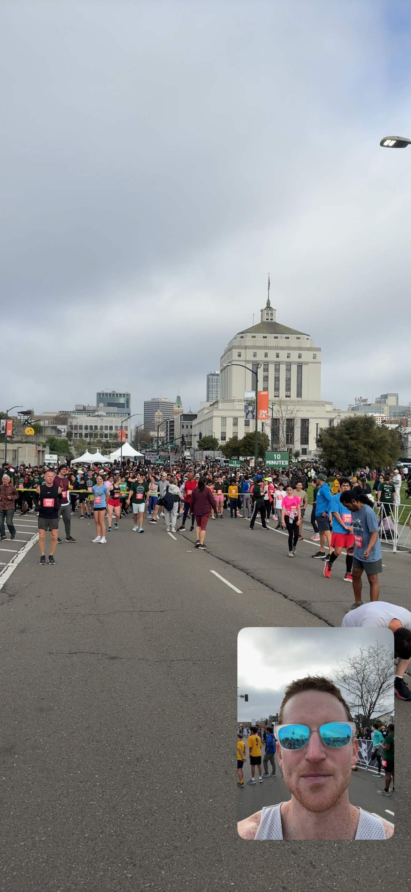
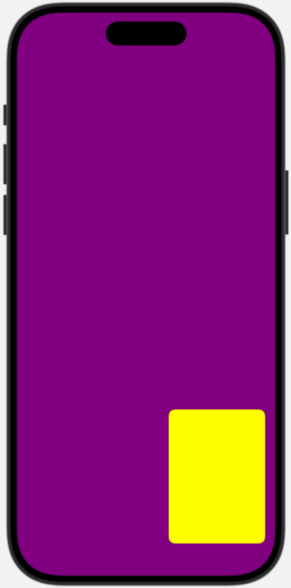

# DualCameraKit


Photo-first simultaneous front and back camera capture for iOS.

`DualCameraKit` uses `AVCaptureMultiCamSession` to run front and back cameras at the same time, renders them with Metal, and captures composed still images from the latest camera frames. v0.5 intentionally ships a tight photo-only surface; video recording is not part of this release.

<table>
<tr>
  <td align="center"><br><b>Photo Capture</b></td>
  <td align="center"><br><b>Composable Layouts</b></td>
</tr>
</table>

## Status

| Category | Status | Description |
| --- | :---: | --- |
| Camera streams | ✅ | Separate front and back `AVCaptureVideoDataOutput` streams over bounded latest-frame subscriptions. |
| Display | ✅ | SwiftUI dual-camera display with PiP, side-by-side, and vertical layouts. |
| Photo capture | ✅ | Composes the latest front/back camera frames using the same layout resolver as display. |
| Drop-in UI | ✅ | `DualCameraScreen` provides a ready-to-use photo capture screen. |
| Video capture | Not shipped | Removed from v0.5 to keep the production API focused; a future release can add a dedicated video product. |

## Installation

Add the package URL in Xcode with **File > Add Packages...**, then choose the product you need:

- `DualCameraKit` for the core controller, display view, renderer, layout, photo capture, and save strategy APIs.
- `DualCameraKitUI` for the drop-in `DualCameraScreen` and bundled controls.

Or add it from `Package.swift`:

```swift
dependencies: [
    .package(url: "https://github.com/Liampronan/DualCameraKit.git", from: "0.5.0")
],
targets: [
    .target(
        name: "YourTarget",
        dependencies: ["DualCameraKit", "DualCameraKitUI"]
    )
]
```

## Requirements

- iOS 17+
- A physical device for live dual-camera capture
- `NSCameraUsageDescription` in your app's `Info.plist`
- `NSPhotoLibraryAddUsageDescription` only if you use `.photoLibrary(service:)`

The simulator uses a mock stream source so previews and UI integration can run without camera hardware.

## Usage

### Drop-in Screen

```swift
import DualCameraKitUI
import SwiftUI

struct ContentView: View {
    var body: some View {
        DualCameraScreen()
    }
}
```

Customize the screen by passing a view model:

```swift
import DualCameraKit
import DualCameraKitUI

let viewModel = DualCameraViewModel(
    layout: .sideBySide,
    photoSaveStrategy: .custom { image in
        upload(image)
    },
    showSettingsButton: true
)

struct ContentView: View {
    var body: some View {
        DualCameraScreen(viewModel: viewModel)
    }
}
```

### Compositional Display

Use `DualCameraDisplayView` and `DualCameraController` when you want your own controls:

```swift
import DualCameraKit
import SwiftUI

struct CameraComposer: View {
    @State private var controller = DualCameraController()
    @State private var capturedImage: UIImage?
    let layout: DualCameraLayout = .piP(miniCamera: .front, miniCameraPosition: .bottomTrailing)

    var body: some View {
        GeometryReader { proxy in
            ZStack(alignment: .bottom) {
                DualCameraDisplayView(controller: controller, layout: layout)

                Button("Capture") {
                    Task {
                        capturedImage = try await controller.capturePhoto(
                            layout: layout,
                            outputSize: proxy.size
                        )
                    }
                }
            }
            .task {
                try? await controller.startSession()
            }
            .onDisappear {
                controller.stopSession()
            }
        }
    }
}
```

## Layouts

```swift
public enum DualCameraLayout {
    case sideBySide
    case stackedVertical
    case piP(miniCamera: DualCameraSource, miniCameraPosition: MiniCameraPosition)
}
```

The same `DualCameraLayoutResolver` drives display placement and captured photo composition.

## Demo App

The demo app lives in this repository on purpose. It exercises the local package and includes three focused examples:

- Drop-in full-screen photo capture
- Container photo capture with review overlay
- Custom compositional UI using `DualCameraDisplayView` + `DualCameraController`

To run it, open `DualCameraKit.xcworkspace`, select the `DualCameraDemo` scheme, set your development team, and run on a device for real camera capture.

## Limitations

- v0.5 is photo-only.
- Live capture requires a physical device that supports multi-cam.
- Simulator support is mock-driven and intended for UI iteration.
- iPad and audio/video capture are future work.

## References

Part of this project was adapted from Apple's [`AVMultiCamPiP: Capturing from Multiple Cameras`](https://developer.apple.com/documentation/avfoundation/avmulticampip-capturing-from-multiple-cameras). This package keeps front and back camera frames as separate streams so layout and capture can be controlled by the library.

## License

This project is available under the [MIT License](LICENSE.md).

